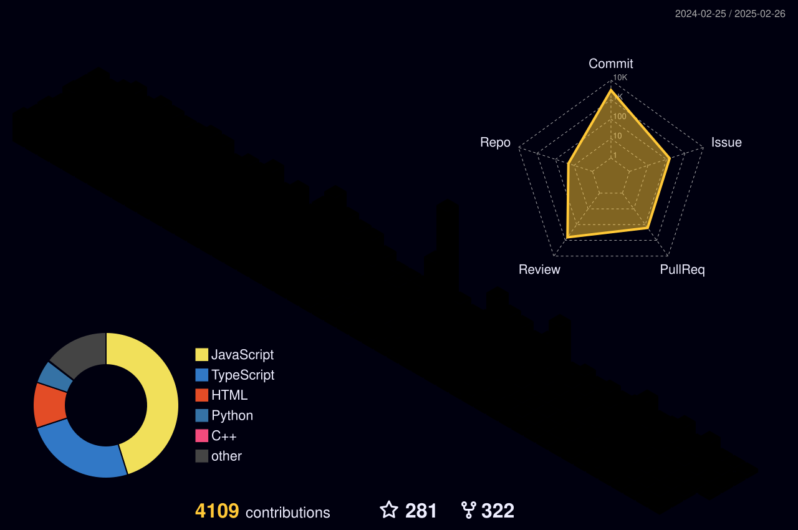

<h1 align="center">Hi, I'm Amit Singh </h1>

<h3 align="center">
  
</h3>

  <samp>
    Hey, My name is <em>Amit Singh</em> and I am a DevOps⚙️ Engineer and a Flutter Developer who is deeply committed to improving the efficiency and effectiveness of software development and deployment processes. My extensive knowledge of **cloud computing, containerization, automation, and mobile app development** enables me to drive innovation and deliver high-quality results. I remain dedicated to continuously expanding my skills by staying up-to-date with the latest DevOps tools, Flutter technologies, and methodologies.🚀
  </samp>
   

<!-- BLOG-POST-LIST:END -->

<!------------------   -------------------------------------------------------------------- -->
<!---------------- Recommend Blog Post ----------------------------------------------------- -->
<!---------------------  ------------------------------------------------------------------- -->

<!------------------   -------------------------------------------------------------------- -->
<!----------------[END] Recommend Blog Post ----------------------------------------------------- -->
<!---------------------  ------------------------------------------------------------------- -->

<samp>Trying to touch and learn 1 new thing everyday!</samp>

---

# Tech Stack 

<samp>Tools & Technologies</samp> | <samp>Badge</samp> |
--- | --- |
<samp>DevOps</samp> |       |
<samp>Cloud Platforms</samp> |    |
<samp>Operating System</samp> |      |
<samp>Programming Languages</samp> |    |
<samp>Frameworks</samp> |    |
<samp>APIs & Tools</samp> |      |
<samp>IDE & Environment</samp> |    |
<samp>Version Control</samp> |   |
<samp>Servers</samp> |    |

<!--- ------------------------------------------------------------------------------------------------------------------------------------------------------ -->
<!--- -- Activity Graph ------------------------------------------------------------------------------------------------------------------------------------ -->
<!--- ------------------------------------------------------------------------------------------------------------------------------------------------------ -->

 

                     
 

<!--- ------------------------------------------------------------------------------------------------------------------------------------------------------ -->
<!--- -- Github Metrics & All ---------------------------------------------------------------------------------------------------------------------------------------- -->
<!--- ------------------------------------------------------------------------------------------------------------------------------------------------------ -->

 

## 📊 Github Stats (Expand to View)  
  

  
<b>💻 GitHub Profile Stats</b>

  
  
&nbsp;

  
<b>📈 My Top Languages</b>

  

  

  
<b>📈 My Contributions</b>

  
  
&nbsp;

 <em><b>I love connecting with different people</b> so if you want to say <b>hi, I'll be happy to meet you more!</b> 😊</em>

<!--- ------------------------------------------------------------------------------------------------------------------------------------------------------ -->
<!--- -- My Socials ---------------------------------------------------------------------------------------------------------------------------------------- -->
<!--- ------------------------------------------------------------------------------------------------------------------------------------------------------ -->

#  The Online Hangout

   
    
  
  
  
  
  
  
   
  
  

<!--
  

  

 
-->

## 🏆 GitHub Trophies

# Github Stats

<!-- ---------------------------------------STATS------------------------------------------
--------------------------------------------------------------------------------------------- -->

                

        
<!-- ---------------------------------------STATS------------------------------------------
--------------------------------------------------------------------------------------------- -->     

       

  

  
  
  
  <a href="https://github.com/amitsingh790634">

  

<!-- ---------------------------------------3D Contributor------------------------------------------
--------------------------------------------------------------------------------------------- -->

<h1> CONTRIBUTIONS</h1>
 

        

  <!--- ------------------------------------------------------------------------------------------------------------------------------------------------------ -->
<!--- -- Snake Contribution Graph -------------------------------------------------------------------------------------------------------------------------- -->
<!--- ------------------------------------------------------------------------------------------------------------------------------------------------------ -->

## 📫 How to reach me? 

  

    
  

#### Thanks for visiting ❤️

